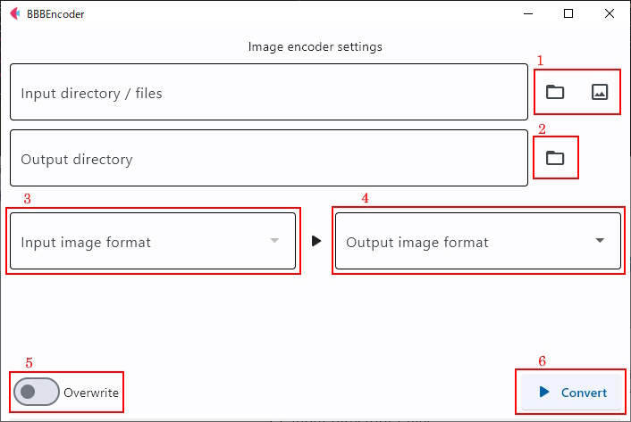

### BBBEncoder

Image Encoder  


Parallel processing for fast image conversion  

support intput image format (some have not been tested)
```
dng, nef, nrw, crw, cr2, cr3, erf, orf, pef, rw2, arw, srf,
sr2, dcr, k25, kdc, mos, mef, 3rf, iiq, png, jpg, tiff,
webp, bmp, gif, dib, icns, im, msp, pcx, ppm, sgi, tga
```

support output image format (some have not been tested)
```
bmp, jpg, png, tiff, webp, gif, im, pcx, ppm, sgi, tga,
pdf, dib, sr, hdr
```

### Usage


1: Select the images to be input.  
2: Select the output directory.  
3: Select the format of the input image.  
4: Select the format of the output image.  
5: Turn on "overwrite" to overwrite a file that already has the same name as the file to be saved.  
6: Press "Convert" button to start conversion.  
